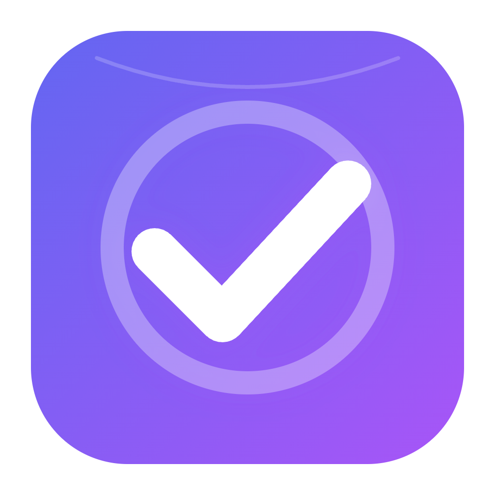

# Task Reporter 🚀

**Task Reporter** est une application Flutter élégante et performante conçue pour simplifier la gestion de vos feuilles de temps (timesheets) sur la plateforme Napta.

## ✨ Fonctionnalités Principales

- **Synchronisation Napta Native** : Connectez-vous avec vos identifiants Napta habituels via une interface sécurisée et retrouvez instantanément vos projets et votre planning.
- **Saisie Intuitive** : Modifiez vos heures en un clin d'œil grâce à des curseurs (sliders) précis pour chaque projet.
- **Commentaires Locaux Privés** : Ajoutez des notes personnelles sur n'importe quel jour. Ces commentaires sont stockés **uniquement sur votre appareil** et ne sont jamais envoyés à Napta.
- **Optimisation Intelligente** : Lors de la sauvegarde, l'application n'envoie que les jours que vous avez réellement modifiés, garantissant une rapidité maximale et évitant d'écraser inutilement vos données existantes.
- **Indicateurs de Statut** : Visualisez en un coup d'œil l'état de vos journées (Validé, En attente, Refusé ou Brouillon) grâce à des icônes et des infobulles claires.
- **Aperçu Visuel** : Chaque cellule du calendrier affiche une barre de progression colorée représentant la répartition de votre temps de travail.

## 🛠 Comment l'utiliser ?

### 1. Connexion
Lancez l'application et utilisez le bouton de connexion pour ouvrir l'interface sécurisée de Napta. Une fois connecté, l'application chargera automatiquement votre profil et vos projets.

### 2. Gestion des Catégories (Projets)

- Cliquez sur le bouton **Catégories** en haut de l'écran.
- Utilisez la barre de recherche pour trouver vos projets Napta.
- Ajoutez-les à votre liste active pour pouvoir leur affecter des heures dans le calendrier.
- Vous pouvez personnaliser la couleur de chaque catégorie pour une meilleure lisibilité.

### 3. Navigation

Utilisez les flèches en haut de l'écran pour naviguer entre les mois. Le bouton "Aujourd'hui" vous permet de revenir instantanément au mois en cours.

### 4. Édition d'une journée

- Cliquez sur n'importe quel jour ouvré pour ouvrir l'éditeur.
- Ajustez les curseurs pour répartir vos Jours-Homme (JH) sur vos différents projets.
- Ajoutez un commentaire local dans le champ dédié si nécessaire.
- Cliquez sur **Enregistrer** pour valider vos modifications localement.

### 5. Sauvegarde sur Napta

Dès que vous avez des modifications non synchronisées, un bouton **Sauvegarder** (icône nuage) apparaît en haut à droite. Cliquez dessus pour envoyer vos modifications à Napta. L'application rafraîchira automatiquement les données après l'opération.

### 6. Soumission pour Approbation

Pour soumettre une semaine complète à votre manager, cliquez sur l'icône **Avion en papier** à droite de la ligne correspondante.

## 🔒 Confidentialité et Sécurité

- **Identifiants** : Vos identifiants de connexion sont gérés directement par le portail sécurisé de Napta.
- **Données locales** : Vos commentaires personnels et vos catégories personnalisées sont stockés localement sur votre appareil. Si vous vous déconnectez, toutes ces données locales sont supprimées pour votre sécurité.

## Installation macOS 🍎💻

- Rendez vous sur la [page de releases](https://github.com/OkilSaber/task_reporter/releases)
- Téléchargez la dernière version en .dmg
- Double cliquez sur le .dmg pour lancer l'installation
- Si un message d'erreur apparaît indiquant que le fichier n'a pas pu être ouvert car il provient d'un développeur non identifié, cliquez sur "Terminé"
- Ouvrez les Réglages système
- Allez dans "Confidentialité et sécurité"
- Tout en bas, cliquez sur "Ouvrir quand même"
- Cliquez sur "Ouvrir"
- Tapez votre mot de passe/Utilisez votre empreinte digitale
- Le DMG s'ouvre
- Glissez Task Reporter dans le dossier Applications
- Fermez le DMG
- Allez dans votre dossier Applications et lancez Task Reporter
- Si un message d'erreur apparaît indiquant que le fichier n'a pas pu être ouvert car il provient d'un développeur non identifié, cliquez sur "Terminé"
- Ouvrez les Réglages système
- Allez dans "Confidentialité et sécurité"
- Tout en bas, cliquez sur "Ouvrir quand même"
- Cliquez sur "Ouvrir"
- Tapez votre mot de passe/Utilisez votre empreinte digitale
- L'application devrait s'ouvrir d'elle même

## 🚀 Installation (Développement)

Si vous souhaitez compiler l'application vous-même :

1. Assurez-vous d'avoir Flutter installé.
2. Clonez le dépôt.
3. Exécutez `flutter pub get` pour installer les dépendances.
4. Lancez l'application avec `flutter run`.

---
*Développé avec ❤️ par Okil pour rendre la gestion du temps plus agréable.*
